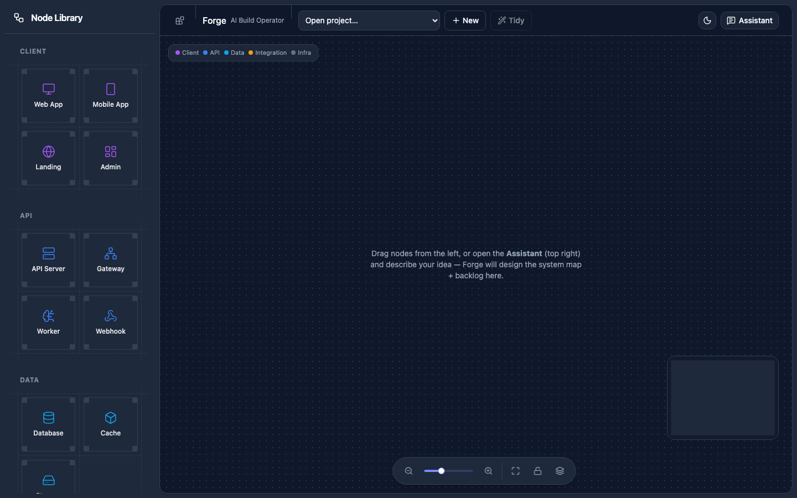
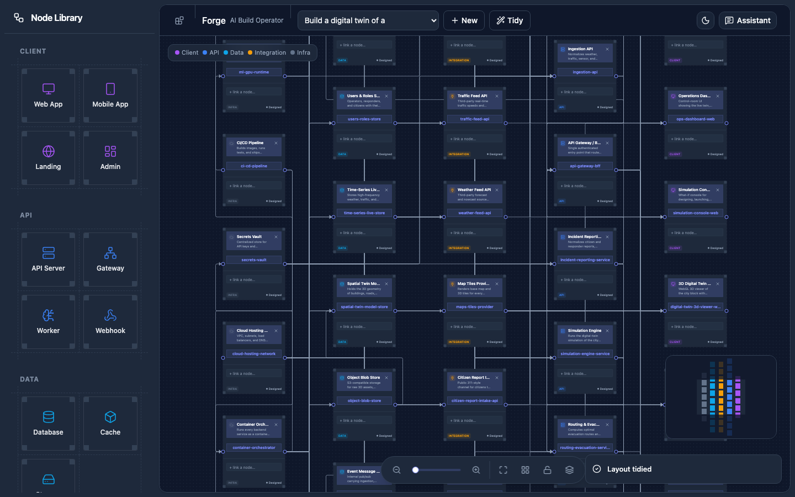
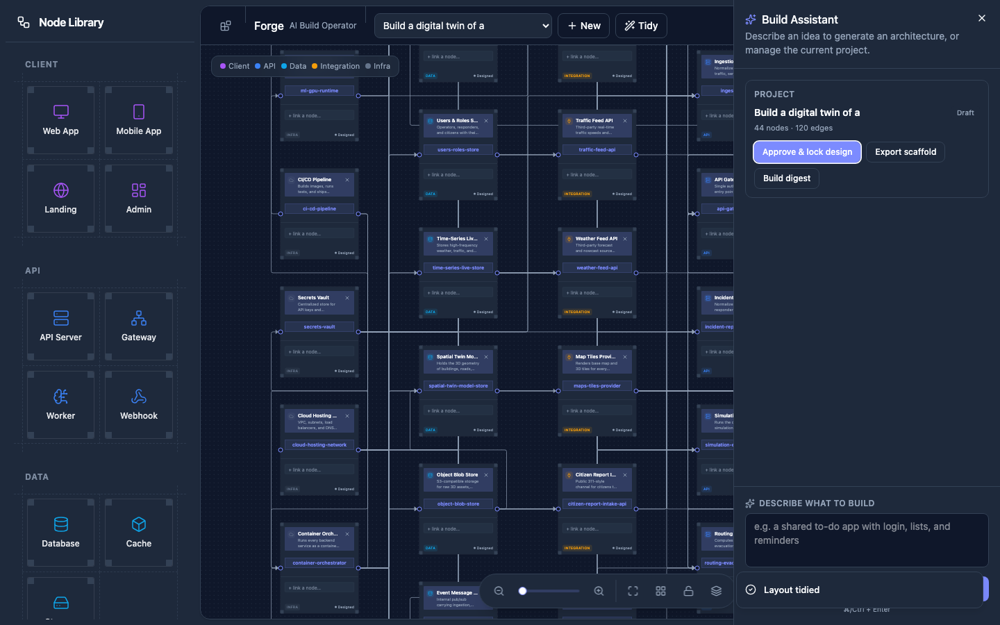
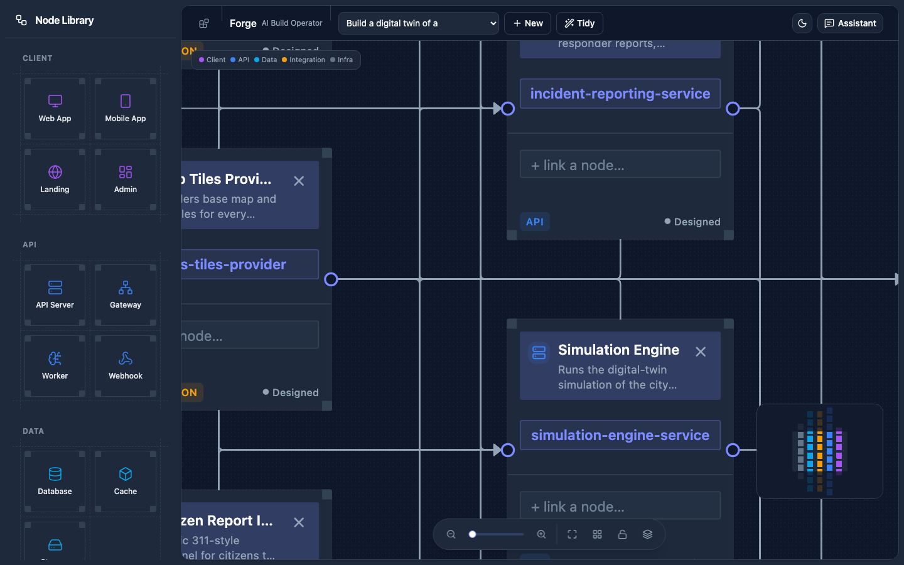
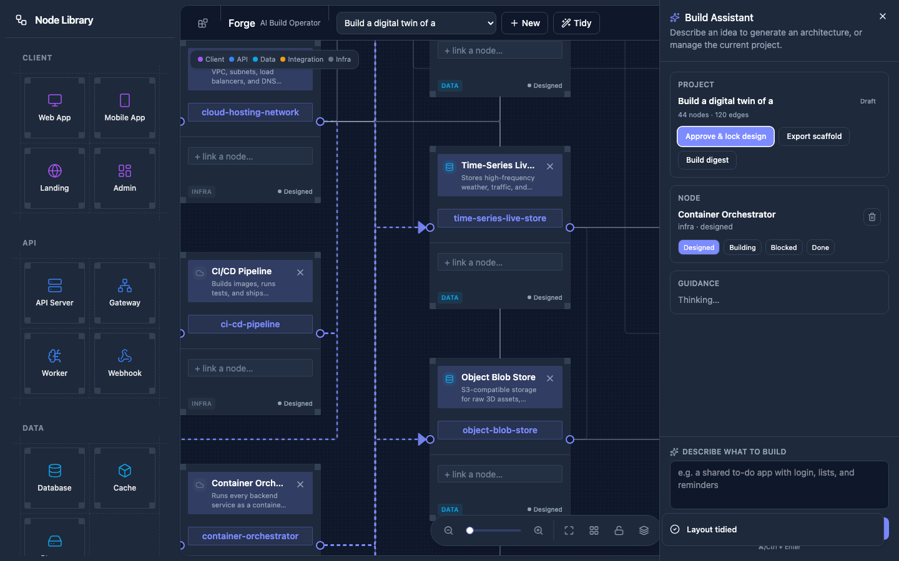

# Forge — AI Build Operator for Solo Founders

> A canvas that turns a one-line idea into a live, editable system-architecture DAG and backlog, then keeps drafting → building → shipping under one persistent state.

Built on the Lemma SDK. Verified live end-to-end against the real Lemma Cloud pod, BFF, and browser.

---

## Live product link

**https://forge-build-operator.apps.lemma.work**

Fully deployed on Lemma — no server of our own, no laptop dependency. The React
app is hosted as a Lemma app on `lemma.work`; the entire backend runs as two Lemma
functions (`forge_api`, `forge_generate`) that authenticate as their own workload
principal. Sign in with a Lemma account to use it. See [§5](#5-architecture) for the
deployed topology.

---

## Table of contents

1. [Problem statement](#1-problem-statement)
2. [Product — what it does and how it solves the problem](#2-product--what-it-does-and-how-it-solves-the-problem)
3. [How we used the Lemma SDK](#3-how-we-used-the-lemma-sdk)
4. [External tools / models / APIs](#4-external-tools--models--apis)
5. [Architecture](#5-architecture)
6. [Feature-by-feature walkthrough (code map)](#6-feature-by-feature-walkthrough-code-map)
7. [Running the project locally](#7-running-the-project-locally)
8. [Screenshots](#8-screenshots)
9. [What is verified](#9-what-is-verified)

---

## 1. Problem statement

**Solo founders lose weeks between "I have an idea" and "there is code shipping."**

The friction is not the coding — it's the *scaffolding* around the code:

- Turning a fuzzy one-liner ("a habit tracker with streaks and reminders") into a **coherent system map** (which services, which data stores, which integrations, which layer sits where).
- Splitting that map into a **task backlog** small enough to actually pick up in the morning.
- Keeping every piece of that work under **one state** — designs, approvals, statuses, notes, per-node guidance — instead of scattering it across Notion pages, Figma boards, Linear tickets, and ChatGPT tabs whose context vanishes at the next login.
- Getting a **decision gate** ("this is the plan; now start building") that is enforceable, not just aspirational — an approval that actually flips records from *designed* → *building* and unlocks the outward-facing actions (GitHub scaffold, digest, etc.).
- Doing all of this **without** wiring five SaaS accounts and paying five bills.

For a solo founder, every hour spent stitching those tools together is an hour not spent on the actual product. And every context switch between them is a chance to lose the plot on what was already decided.

We wanted a single screen where the loop
**`input → state → action → approval → outcome`**
happens on one persistent, queryable, versioned surface — powered by a runtime the founder does not have to operate.

---

## 2. Product — what it does and how it solves the problem

**Forge** is the one-screen AI Build Operator for that loop. Every unit of state — projects, nodes, edges, tasks, per-node guidance threads — is a row in a Lemma Cloud table, retrieved via `pod.records` and RAG-searched via `pod.files`, and mutated only through the same SDK. There's no side database.

### The core loop (what a founder does)

1. **Input.** Type a build idea into the pinned assistant textarea ("a shared to-do app with login", "a digital twin of a city block", …).
2. **State.** Forge streams a system-architecture DAG onto the canvas — nodes coloured by layer (Client / API / Data / Integration / Infra), edges enforced as a DAG (a cycle returns HTTP 400 at the BFF), and every node is persisted as a `nodes` record plus a `tasks` backlog seeded from the same generation call. What's on the canvas *is* the state — refresh, come back tomorrow, it's still there.
3. **Action.** Click any node and the assistant drawer fetches RAG-grounded, per-node guidance (10 build steps, 7 checks, 6 tech picks) from the `/knowledge` files, cached by a 16-char qhash so repeat clicks are instant. You can also drag nodes from the palette, connect handles, rename inline, or type `+ link a node…` to autocomplete an edge to another node.
4. **Approval.** Hit **Lock design** and the whole board's nodes flip `designed → building`, tasks flip `none → approved`, and `projects.design_locked=true`. Approval is a first-class record state, not a chat-message convention.
5. **Outcome.** With the design locked, the outward-facing actions unblock: **Export scaffold** (an approval-gated GitHub scaffold; `--push` requires `GITHUB_TOKEN` and is off by default) and **Build digest** (a classifier over records — shipped / in-progress / blocked / ready — plus an agent-written prioritized digest). Trying either before the lock returns HTTP 409.

### Why this works

- **One surface, one state.** The founder never leaves the canvas. Every state change — a status flip, a rename, a new edge, a lock, an export — is a record write, and the canvas is just a live view over those records.
- **AI handles the scaffolding, the founder steers.** Generation is a single agent call (`agent="hello"`, on the org's runtime profile) that emits the whole architecture and backlog in one JSON blob. The frontend never blocks on it — it streams stage events (`grounding → grounded → decompose → decomposed → refine → persisting → done`) over SSE, with a **Stop** button that aborts the generator cleanly and leaves no orphan project.
- **Approval is enforced, not just implied.** The BFF's `require_design_lock` gate, mapped through `PermissionError → HTTP 409`, means outcomes genuinely can't run before the design is signed off — it's a hard record-state check, not a polite convention.
- **Minimal ops overhead.** The agent's LLM runs on the runtime profile, server-side, so no OpenAI or Anthropic key is needed anywhere in this repo. `Pod.from_env()` reads `~/.lemma/config.json`, and token expiry self-heals in the BFF via `lemma auth print-token` on a 401.

---

## 3. How we used the Lemma SDK

We used the SDK as the **only** backend layer — no side DB, no side inference, no side file storage. Every route in `backend/main.py` is a thin wrapper over one of these primitives:

| Lemma primitive | Where we use it | What it does for us |
|---|---|---|
| **`Pod.from_env()`** | `backend/lemma-map/_forge.py::open_pod` | One shared, lazy Pod handle across all BFF routes. Reads org+pod defaults from `~/.lemma/config.json` (`--save-default` set once); no env vars required. |
| **`pod.tables.*`** | `backend/lemma-map/setup_tables.py` | Provisioned 5 hackathon tables — `projects`, `nodes`, `edges`, `tasks`, `node_threads` — via `create_from_dict({...})` with typed columns (TEXT/INTEGER/JSON/DATETIME, plus later `nodes.slug` TEXT + `projects.summary` TEXT added with `add_column`). RLS off for shared app tables. |
| **`pod.records.*`** | Everywhere — `_forge.list_all`, `generate_architecture.persist`, `approvals.set_node_status`, `main.py` node/edge CRUD | Every write. `insert` / `bulk_insert` for generation persistence, `update` for status flips, `delete` / `bulk_delete` for cascade node deletion, filter clause shape `{"field","op","value"}`. Records are keyed by **slug** within a project (edges.source/target, tasks.node_id, canvas node id are all the same slug). |
| **`pod.agents.run("hello", …)`** | `_forge.ask` | The generation agent. `AGENT="hello"` is the starter agent — its LLM is the org **runtime profile** (server-side, no model string in this repo). Called from both the sync `generate_architecture` and the streaming SSE path. |
| **`pod.conversations.*`** | `_forge.ask` | Reply is async — we poll `pod.conversations.get(cid).status` + `pod.conversations.messages(cid).to_dict()["items"]` for the last non-user TEXT message (poll interval 2s). Timeout bumped: `pod.generated.get_httpx_client().timeout = httpx.Timeout(300.0)` because the SDK default is 30s and agent calls routinely exceed it. |
| **`pod.files.search(scope_path="/knowledge", scope_mode="SUBTREE", search_method="HYBRID")`** | `_forge.search_knowledge` / `ground` | RAG grounding. Runs the founder's prompt through hybrid search over the `/knowledge` doc set the pod ships with, and prepends the top results to the generation prompt (budget ~1800 chars). Only doc formats are indexed (no CSV/JSON) — verified in the smoke pass. |
| **`pod.files.upload`** | `backend/lemma-map/seed_knowledge.py` | Seeded 4 grounding docs (`patterns.md`, `layers.md`, `guardrails.md`, `tech_choices.md`) into `/knowledge` at setup — this is the corpus the RAG search grounds against. |

### Two things worth calling out

1. **Approval as a record state.** We deliberately did **not** use Lemma's agent-tool approval mechanic; `approvals.py::lock_design` is a plain record update — `designed → building` on `nodes`, `none → approved` on `tasks`, `design_locked=true` on `projects`, all in a single pod round. That way the approval survives across restarts, browsers, and clients, and the gate (`require_design_lock`) is a filter on records — the source of truth is the pod, not any single client.
2. **BFF auth self-heal.** Cloud tokens expire ~hourly; a long demo used to die mid-run. `backend/main.py::guard()` catches expired-token 401s, subprocess-invokes `lemma auth print-token` (which refreshes `~/.lemma/config.json` from the stored refresh token), patches the **already-open** Pod's `Authorization` header in place, and retries once. No relogin, no browser bounce.

---

## 4. External tools / models / APIs

By design, almost everything is Lemma-native — but here is the complete list of things outside the SDK:

| External | Where | Why |
|---|---|---|
| **FastAPI + Uvicorn** | `backend/main.py`, `requirements.txt` | The BFF layer between browser and pod. Chosen because it maps 1:1 onto `pod.records` and keeps request-scoped auth simple. |
| **httpx** | `backend/lemma-map/export_repo.py`, timeout config in `_forge.py` | (1) Raw GitHub REST calls in `export_repo` because we deliberately avoided the Lemma GH connector — the scaffold is **dry-run by default** and only pushes with `--push <owner> <repo>` + `GITHUB_TOKEN`. (2) Overriding the SDK's default 30s timeout so agent runs don't die. |
| **React 19 + Vite 6 + Bun** | `frontend/` | Build tooling. `bun run dev` for the dev server, `bun run build` (`tsc -b && vite build`) for the real typecheck. |
| **React Flow 11 (`reactflow`)** | `frontend/src/components/forge/forge-canvas.tsx`, `pipeline-controller.tsx` | The DAG canvas — node dragging, edge drawing, minimap, zoom / pan / fit controls, viewport transforms. |
| **shadcn/ui + Radix + Tailwind v4** | `frontend/src/components/ui/*` | Sidebar-inset layout (`SidebarProvider` + `Sidebar` collapsible=offcanvas + `SidebarInset`), `Sheet` for the assistant drawer (with `modal={false}` so the canvas stays interactive), `Command` for the "+ link a node…" tag autocomplete. |
| **`lucide-react`** | Node icons per layer + toolbar (`LayoutGrid` for Arrange, `WorkflowIcon` etc.) | Icon set. |
| **`sonner`** | Toasts (build result, Stop, errors) | Notifications. |
| **`next-themes`** | `ModeToggle` in the header | Light / dark mode. |
| **Chromium via Playwright cache** | `docs/screenshots/` capture only | Used to script the screenshots for this document. Not a runtime dependency. |
| **Optional at runtime** | | Only touched when the founder opts in: **`GITHUB_TOKEN`** (`export_repo --push`), **Lemma connector** (Slack/Gmail for `digest.send_digest`), **Lemma cron** (`register_daily_schedule`). All off by default. |

### About the LLM

**There is no LLM API key in this repo, and no model name in this repo.** The generation agent (`AGENT="hello"` in `_forge.py`) delegates to the org's Lemma **runtime profile**. `lemma agents get hello` shows `agent_runtime: null` → inherits the default `system:lemma` profile (default model **`minimax-m3`**, 6-model catalog). To swap in a free / OpenCode-harness model:

```bash
lemma runtime profiles create USER_DAEMON --harness OPENCODE --daemon-id <id> --name OpenCode
lemma agents update hello --pod forge -d '{"agent_runtime": <profile-id>}'
```

— all done in Lemma, no code change.

---

## 5. Architecture

```
┌────────────────────────── Browser (React 19 / Vite / bun) ──────────────────────────┐
│                                                                                     │
│   ForgeScreen  ─────────────────────────────────────────────────────────────────┐    │
│   ├─ Header  (NodeLibraryTrigger · project select · New · Tidy · Assistant)    │    │
│   ├─ Sidebar (ForgePalette — draggable Node Library, collapsible=offcanvas)    │    │
│   ├─ Inset workspace card                                                      │    │
│   │   └─ ForgeCanvas ──► React Flow                                             │    │
│   │       ├─ ForgeNode  (inline rename · "+ link a node…" · layer/status badge)│    │
│   │       └─ PipelineController toolbar (Zoom · Fit · Arrange · Lock · MiniMap)│    │
│   └─ Sheet (Assistant drawer — build description · project actions · guidance) │    │
│                                                                                │    │
│   forgeApi (fetch + SSE stream reader + AbortController for Stop)              │    │
└────────────────────────────────────┬────────────────────────────────────────────┘    │
                                     │ REST + SSE over :8000
┌────────────────────────────────────▼────────────────────── BFF ──────────────────────┐
│  backend/main.py — FastAPI                                                          │
│  ├─ /api/generate           (sync)                                                  │
│  ├─ /api/generate/stream    (SSE — grounding→grounded→decompose→…→persisting→done)  │
│  ├─ /api/projects           (list · new blank)                                      │
│  ├─ /api/projects/{id}      (reactflow-shaped graph + tasks + summary)              │
│  ├─ /api/projects/{id}/nodes         POST · PATCH · DELETE                          │
│  ├─ /api/projects/{id}/edges         POST (DAG-guarded → 400 on cycle) · DELETE     │
│  ├─ /api/projects/{id}/relayout      (barycenter layered layout)                    │
│  ├─ /api/projects/{id}/lock · unlock (approval = record state)                      │
│  ├─ /api/projects/{id}/export · digest (409 unless design_locked)                   │
│  ├─ /api/nodes/status                                                               │
│  └─ /api/guidance                                                                   │
│  guard() → maps PermissionError→409 · ValueError→400 · 401→auth self-heal + retry   │
└────────────────────────────────────┬────────────────────────────────────────────────┘
                                     │ lemma_sdk
┌────────────────────────────────────▼──────────── Lemma Cloud pod "forge" ───────────┐
│  Tables: projects · nodes · edges · tasks · node_threads                            │
│  Files:  /knowledge (patterns.md · layers.md · guardrails.md · tech_choices.md)     │
│  Agent:  "hello"  → org runtime profile (default: minimax-m3)                       │
└─────────────────────────────────────────────────────────────────────────────────────┘
```

### Deployed topology (production — the live link)

The FastAPI BFF above is the **local-dev** transport. In production there is **no
server of ours at all**: the same React app is deployed as a Lemma app on
`lemma.work`, and every BFF route was ported onto two **Lemma functions** that run
on the Lemma runtime (always-on, free) and authenticate as their own **workload
principal** — so the hourly token self-heal simply disappears.

```
Browser  →  https://forge-build-operator.apps.lemma.work   (Lemma sign-in)
  host injects window.__LEMMA_CONFIG__ + serves /public/sdk/lemma-client.js
        │  client.functions.run("forge_api",  { action, … })      ← fast ops (API fn)
        │  client.functions.run("forge_generate", { prompt })     ← generation (JOB fn, polled)
        ▼
Lemma functions  (Pod.from_env() = workload principal; grants on the tables/folder/agent)
  forge_api       (type API) → projects · project · guidance · node_status ·
                               lock/unlock · export · digest · node+edge CRUD · relayout
  forge_generate  (type JOB) → generate_architecture  (runs ~2 min → async)
        ▼
Same pod "forge": tables · /knowledge · agent "hello"
```

- **One frontend file changed** (`src/lib/forge-api.ts`): it feature-detects
  `window.__LEMMA_CONFIG__` and routes to `client.functions.run(...)` when hosted, or
  the REST BFF when local — identical return shapes, so the canvas/nodes are untouched.
  A small `src/lib/lemma-client.ts` loads the SDK + gates auth before the app mounts.
- **Backend as functions** lives in `backend/forge-fn/` — `build.py` inlines the
  `backend/lemma-map/` core modules into one `code.py` per function (function bundles
  ship a single file), keeping `lemma-map/` the single source of truth. Grants are
  declared in each function's JSON bundle.
- The only UX difference from local: hosted generation is a polled JOB with a
  "building…" state instead of the live SSE stage-stepper (functions can't stream to
  the browser). Everything else is identical.

**Layered data model** (all in the pod, all mutated via `pod.records`):

- `projects` — `id`, `name`, `status`, `design_locked`, `summary` (markdown), timestamps.
- `nodes` — `id`, `project_id`, **`slug`** (edge key & canvas id), `title`, `summary`, `layer` (client / api / data / integration / infra), `kind`, `status` (designed / building / done / blocked), `pos_x`, `pos_y`.
- `edges` — `id`, `project_id`, `source` (slug), `target` (slug). DAG-enforced by `is_dag` + `acyclic_subset` at generate time and by the BFF on manual edge create.
- `tasks` — `id`, `project_id`, `node_id` (slug), `title`, `status` (none / approved / done).
- `node_threads` — `id`, `project_id`, `node_id`, **`qhash`** (16-char), `question`, `answer` (markdown) — the guidance cache.

**Barycenter layered layout** (`generate_architecture.layout`) — reused by both generation persistence and the `/relayout` endpoint behind the header **Tidy** and the toolbar **Arrange** buttons. Constants: `COL_GAP=400`, `ROW_GAP=340` (bumped from 360/150 to fit the taller node cards after the tag field was added).

---

## 6. Feature-by-feature walkthrough (code map)

### 6.1 Generation → live streaming DAG

- `backend/lemma-map/_forge.py` — shared core: `open_pod`, `retry` (transient 503/429/conn-drop-safe), `ask` (agent send + poll), `split_reply` (extracts the ```json fence + `## Build Summary` md), `search_knowledge`, `ground`.
- `backend/lemma-map/generate_architecture.py::generate_steps(pod, prompt)` — a **Python generator** that yields staged events (`grounding → grounded → decompose → decomposed → refine → persisting → done`), single agent pass emitting nodes + edges + tasks together; `normalize()` repairs to a valid DAG + back-fills tasks. **No node cap.**
- `backend/main.py::/api/generate/stream` — `StreamingResponse(text/event-stream)`, frames each event as `data: {json}\n\n`, headers `Cache-Control: no-cache`, `Connection: keep-alive`, `X-Accel-Buffering: no`. `_ensure_auth(pod)` warms a fresh token before the long run. **On client disconnect Starlette stops pulling the generator, so persist never runs → no orphan project.**
- `frontend/src/lib/forge-api.ts::generateStream(prompt, {onProgress, signal})` — reads the SSE body via `getReader()` + `TextDecoder`, splits on `\n\n`. `signal` is an `AbortController` driving the **Stop** button; on stop the fetch cancels, backend generator dies, UI resets to idle.
- `frontend/src/components/forge/forge-canvas.tsx` — the "Designing your architecture" overlay: live stage label + 4-segment stepper + running node / task counts.

### 6.2 The canvas (DAG board)

- `frontend/src/components/forge/forge-screen.tsx` — the orchestrator. Owns all state, wraps `ReactFlowProvider`, sets up `ForgeNodeContext` (rename / commit-rename / connect-nodes bridge from screen → each node).
- `frontend/src/components/forge/forge-canvas.tsx` — presentational. `onDrop` (palette drag → create node), `onConnect` (edge draw → `createEdge` with 400-on-cycle guard), `nodeDragStop` (persist position), `onNodesDelete` / `onEdgesDelete` (cascade delete). **Edge readability:** arrowheads + smoothstep + select-to-highlight (selected node's edges stroke 2.5 / opacity 0.90, all others 1.5 / 0.18).
- `frontend/src/components/forge/forge-node.tsx` — one node type renders BOTH generated + hand-dragged. Corner accent brackets (from legacy `work-flow/nodes/accents`), tinted `bg-primary/20` header (layer icon + inline-editable title + summary + delete X), immutable **slug** in a blue tag box (slug = edge source/target & canvas id), a `Command`-dropdown **`+ link a node…`** tag field that filters other nodes and, on pick, calls `createEdge(picked → this)` — restoring the old `{{mention}}` auto-edge behaviour. Layer + status badges. No coloured left border.
- `frontend/src/components/forge/forge-palette.tsx` — real shadcn `Sidebar` (`collapsible="offcanvas"`, `variant="inset"`). Dashed 2-col category grid (Client / API / Data / Integration / Infra + kept Workflow nodes), each card with corner brackets.

### 6.3 Assistant drawer (right rail)

- Shadcn `Sheet side="right" modal={false}` (canvas stays visible + interactive — no overlay). Contents:
  - Pinned build-description textarea + **Design build** button + full-width **Stop** during a run + progress card mirroring the canvas overlay.
  - Project actions — **Lock / Unlock design**, **Export scaffold** (409 pre-lock), **Build digest**.
  - Node panel — per-node status controls.
  - Guidance panel — RAG-grounded per-node guidance, streamed in on node click.
- Auto-closes on a successful generate so the fresh board is visible.

### 6.4 Per-node RAG guidance

- `backend/lemma-map/guide_node.py` — per-node question hits `pod.files.search` over `/knowledge`, then runs a small agent pass to produce **10 build steps / 7 checks / 6 tech picks** grounded in the docs. The result is written to `node_threads` keyed by `qhash = hash16(node_slug|question)`. Repeat calls with the same qhash return the cached row — verified `cached:true` on the second click.
- `backend/main.py::/api/guidance` wraps it.

### 6.5 Approvals as record state

- `backend/lemma-map/approvals.py::lock_design(pod, project_id)` — updates all `nodes` (status `designed → building`), updates all `tasks` (status `none → approved`), sets `projects.design_locked=true` — one transaction of `pod.records` writes.
- `require_design_lock(pod, project_id)` — reads the project row; if `design_locked=false` raises `PermissionError`.
- `backend/main.py::guard()` — maps `PermissionError → 409 Conflict`, `ValueError → 400 Bad Request`.

### 6.6 Outcomes (approval-gated)

- `backend/lemma-map/export_repo.py` — GitHub scaffold via raw `httpx` REST (deliberately not the Lemma GH connector). **Dry-run by default** — outputs a 9-file manifest (README, package.json, backend stubs per node, `.github/workflows/ci.yml`, etc.). Only pushes when called with `--push <owner> <repo>` **and** `GITHUB_TOKEN` set.
- `backend/lemma-map/digest.py` — `compute_state` is a pure record classifier (shipped / in-progress / blocked / ready); `build_digest` runs a small agent pass over that classification to produce a prioritized markdown digest. `send_digest` (Slack/Gmail connector) and `register_daily_schedule` (Lemma cron) are optional and off by default.

### 6.7 Tidy + Arrange (layered layout)

- `backend/lemma-map/generate_architecture.py::layout` — barycenter layered layout with crossing reduction, columns centered. `COL_GAP=400`, `ROW_GAP=340`.
- `backend/lemma-map/generate_architecture.py::relayout_project` — reruns the layout over an existing project and persists new `pos_x` / `pos_y`.
- `backend/main.py::/api/projects/{id}/relayout` wraps it.
- Header **Tidy** button + toolbar **Arrange** button both call the same endpoint; the toolbar button (a `LayoutGrid` control next to Fit-to-View) additionally fires `fitView` with a 500 ms tween.
- Verified: min vertical gap **340 px, 0 overlapping pairs** across 44 nodes / 5 columns.

### 6.8 Auth self-heal

- `backend/main.py::guard()` — catches 401 / expired-token, subprocess-runs `lemma auth print-token` (refreshes `~/.lemma/config.json`), patches the already-open shared Pod's `Authorization` header, retries once.

---

## 7. Running the project locally

### Prerequisites

- **Lemma CLI + auth.** `lemma auth login` once (org + pod already saved with `--save-default`).
- **Python 3.12** + a project venv at `backend/.venv` (uv-managed; if empty: `uv venv backend/.venv && uv pip install -r backend/requirements.txt`).
- **Bun** (`curl -fsSL https://bun.sh/install | bash`).

### One-time setup (already done in the seeded pod — skip if re-verifying)

```bash
cd backend && source .venv/bin/activate
python lemma-map/setup_tables.py    # provisions 5 tables (idempotent)
python lemma-map/seed_knowledge.py  # uploads 4 grounding docs to /knowledge
```

### Run

```bash
# 0. refresh auth if the token expired between sessions
lemma auth print-token

# 1. BFF — terminal 1
cd backend && source .venv/bin/activate
python -m uvicorn main:app --host 127.0.0.1 --port 8000 --reload

# 2. Frontend — terminal 2
cd frontend
bun install    # first run only
bun run dev    # opens on the printed URL (usually http://localhost:3000, :3001 if 3000 is held)
```

Open the printed URL. The project dropdown will already have two seeded demo projects:

- `51a870eb-54a0-4df2-955e-4d95c3928e94` — **shared to-do app** (locked, one node marked done)
- `07966e35-fca7-4765-b469-41edb9cfa778` — **habit tracker** (21 nodes)

### CLI smoke (verify without the browser)

```bash
cd backend && source .venv/bin/activate

python lemma-map/generate_architecture.py "a shared to-do app with login"
python lemma-map/guide_node.py            # second run = CACHE HIT
python lemma-map/approvals.py "" status
python lemma-map/approvals.py "" lock
python lemma-map/export_repo.py           # dry-run scaffold, no GitHub call
python lemma-map/digest.py                # on-demand digest
```

### Build / typecheck

```bash
cd frontend
bun run build          # tsc -b && vite build — the real typecheck
# NOTE: do NOT use `bunx tsc` — it resolves a typosquat npm package
#       (fake "tsc" v6.0.3 that prints help). Use ./node_modules/.bin/tsc
#       for a bare tsc if you need one.
```

### Deploy / redeploy (the live link)

```bash
# Backend: (re)build the single-file function bundles from lemma-map/, then import
cd backend
.venv/bin/python forge-fn/build.py
lemma pods import forge-fn/functions            # creates/updates forge_api + forge_generate

# Frontend: build, then deploy the static bundle as a Lemma app
cd ../frontend
bun run build
lemma apps deploy forge-build-operator dist --yes

# Smoke without a browser
lemma functions run forge_api -d '{"action":"projects"}'
lemma functions run forge_generate -d '{"prompt":"a todo app"}' --wait
```

---

## 8. Screenshots

All shots taken live against the running app on **1440 × 900**, dark mode, project `Build a digital twin of a city block…` (44 nodes / 120 edges).

### 8.1 Empty canvas — first paint

Left sidebar shows the **Node Library** (Client / API / Data / Integration / Infra + Workflow). Header shows the sidebar collapse trigger at the left corner, project dropdown, **New**, **Tidy**, theme toggle, and **Assistant**. Empty-state hint in the middle of the workspace card. Bottom-center toolbar has Zoom / Fit / Arrange / Lock / MiniMap.



### 8.2 Project loaded — full DAG

Selecting a project in the header dropdown fetches `/api/projects/{id}`, feeds `nodes` + `edges` into React Flow, and lays them out in barycenter-layered columns. Node cards are coloured per layer via the header tint + badge; edges are smoothstep + arrow-headed.



### 8.3 Assistant drawer open

Clicking **Assistant** slides the right rail in (shadcn `Sheet`, `modal={false}` — canvas stays visible + interactive, no overlay). Top: build description textarea + **Design build** button + **Export scaffold** action. Below: **Project** (Build digest, current summary), **Guidance** (streams in when a node is selected), and **Describing what to build** helper text.



### 8.4 Node close-up — rename + `+ link a node…` + layer badge + status

Zoomed into the workspace so the anatomy of a single node is visible:

- Header — layer icon + inline **editable title input** (persists on blur via `PATCH /api/projects/{id}/nodes/{slug}` with the `title` field), delete X.
- Body — summary text.
- Blue tag box — **immutable slug** (edge source/target & canvas id).
- **`+ link a node…`** — the tag/mention input; typing opens a `Command` dropdown filtering the other nodes; picking one calls `POST /api/projects/{id}/edges` (DAG-guarded, cycle → 400).
- **Layer badge** (API / …) + **status pill** (Designed / Building / Done / Blocked).



### 8.5 Node click → guidance panel

Clicking a node fires `POST /api/guidance` (RAG-grounded from `/knowledge`), writes into `node_threads` keyed by qhash, and streams the answer into the drawer's Guidance section. Repeat click on the same node returns a cache hit.



---

## 9. What is verified

- **Steps 3–6 verified live end-to-end** against Lemma Cloud, the FastAPI BFF, and the browser (see `FORGE_STATUS.md` for the per-step table).
- **BFF routes** — every `/api/*` route exercised against the real pod; DAG cycle guard returns **400**, missing lock returns **409**.
- **Generation streaming + abort** — full run (28 nodes / 61 edges / 56 tasks, 403 s); Stop mid-flight → clean abort, **no orphan project, 0 console errors**.
- **Layout** — `bun run build` clean (`tsc -b && vite build`), **0 console warnings** at rest, min vertical gap **340 px, 0 overlapping pairs** across 44 nodes / 5 columns after Arrange.
- **Auth self-heal** — expired-token 401 → `lemma auth print-token` → Pod header patched → retry succeeds without user action.

Deliberately NOT exercised (off by default): `export_repo --push` (needs `GITHUB_TOKEN`, writes to real GitHub), `digest.send_digest` (needs connector), `register_daily_schedule` (Lemma cron). All three are one flag away.

---

*Built on Lemma Cloud pod **forge** `019f0dde-6958-768a-91c3-117c0eb74a6f`, org `019f0dc7-2451-74c2-a4d6-2fe40f039fce`. Frontend on `bun` + Vite 6 + React 19 + React Flow 11 + Tailwind v4 + shadcn/ui. Backend on FastAPI + `lemma-sdk==0.5.3`.*
